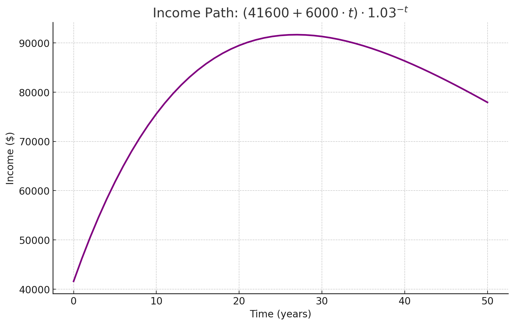

Let’s suppose that all hours are equivalently valuable, and that you can easily earn more money by working more hours. There is still [one more problem with valuing your time at your current average wage](https://joel-becker.com/digital-garden/mistakes-valuing-time/): not appropriately accounting for future benefits and costs.

Consider the following model of career progression:

- In year \\(0\\), you are paid \\(\$X\\) (in nominal terms).
- In year \\(1\\), you are paid \\(\$(X + W)\\), or \\(\$(X + W) \times R^{-1}\\) in real terms.
- In year \\(t\\), you are paid \\(\$(X + W \times t)\\), or \\(\$(X + W \times t) \times R^{-t}\\) in real terms.

This dumb model produces income paths that aren’t so dissimilar from (my memory of) typical US income paths, at least for reasonable values of \\(W\\) and \\(R\\).

In this model, lifetime income from \\(t=0\\) onwards is given by \\(\sum_{t=0}^T \$(X + W \times t) \times R^{-t}\\).

Now, let’s say you have the option to work \\(H\\) hours more for 1 year, which would earn you a promotion associated with earning an extra \\(H \times W / 500\\) next year. Further, due to the persistence of career capital, promotion raises are persistent: you will get the \\(H \times W / 500\\) each year until retirement.

How much is this opportunity worth? 

From the perspective of \\(t=0\\), the additional income from \\(t=s\\) onwards is worth \\(\sum_{t=s}^T (H \times W / 500) \times R^{-t}\\). For \\(W=6,000\\), \\(R=1.03\\), additional income as a function of \\(s\\) and \\(H\\) is as in the heat map below.[^1]

Early in your career, on this model, an extra $30,000 in lifetime income looks achievable with 2 hours extra work per week for a year.

Previously, following conventional practice, you might have used current hourly wage as a proxy for the value of time. Let’s call this $20, as implied above.

Now, you see an additional \\(\$30,000 / 100 = \$300\\) gross benefit _per extra hour you work early in your career_.

So, shouldn’t your value of time be closer to $320, 16x higher than your earlier guess?

I can see a couple of reasons why this might be too aggressive:

1. Decreasing marginal returns from extra income.
2. This “investment” logic might apply to other areas of your life, not just work.
3. The boost to your future career capital and therefore pay might not be so persistent; it might even be totally transient (e.g. if you get the promotion without in fact developing new career capital) or even persistently negative (e.g. if you burn out).
4. You apply a significant discount rate to future income.

Fair enough. But the logic feels directionally correct; **not appropriately accounting for future benefits and costs can lead to significant miscalculations of the value of your time**.

[^1]: There are two further implications of this model to draw attention to. First, increasing work hours earlier has dramatic returns. See [Sam Altman's advice on work-life balance in your 20's](https://youtu.be/sYMqVwsewSg?si=dq48FVj9DlsssBas&t=219). Second, your inability to adjust on the intensive margin of hours is not a big deal in practice, at least not early in your career, because most benefits from working harder are realized in the future.